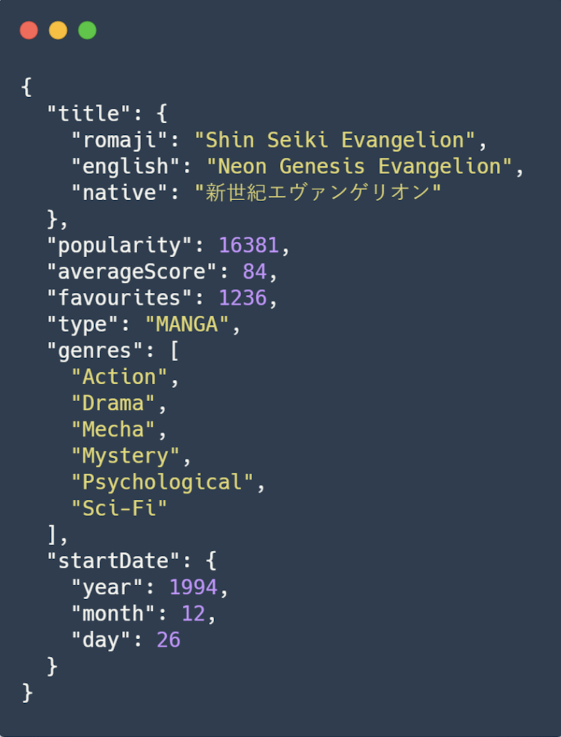

<p align="center">
  
</p>

<h1 align="center">LSManga - Recursive Sorting</h1>

<p align="center">
  <a href="https://www.java.com">
    
  </a>
  <a href="https://github.com/hexstorm9/AgeRoyale/tree/develop">
    
  </a>
    <a href="https://opensource.org/licenses/BSD-3-Clause">
    
  </a>
</p>

<p align="center">
    LSManga is a University Project for Recursive Sorting datasets of manga series opinions. It implements QuickSort, MergeSort and BucketSort.
</p>


## Features
- [x] 3 Different Recursive Sorting Algorithms: QuickSort, MergeSort and BucketSort
- [x] Order the Datasets by Average Score, Premiere Date or by Popularity/Average Score/Favoritism
- [x] Generate new Datasets
- [x] Measure how long it takes for an algorithm to order a Dataset

## Dataset Entry Example


## How To Use
```bash
# Install IntelliJ Community Edition (Linux)
$ sudo snap install intellij-idea-community --classic

#Install IntelliJ Community Edition (MacOS)
$ brew cask install intellij-idea


# Clone this repository
$ git clone https://github.com/bielcarpi/LSManga-RecursiveSorting

# Open the project on IntelliJ and Run it
```
